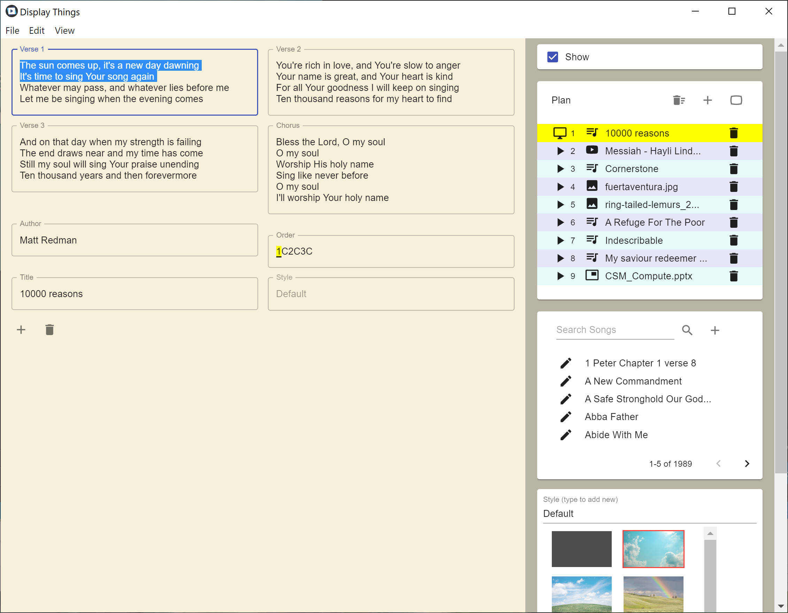
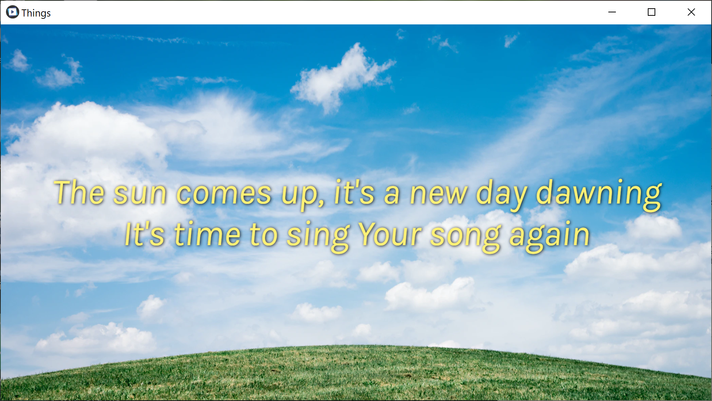
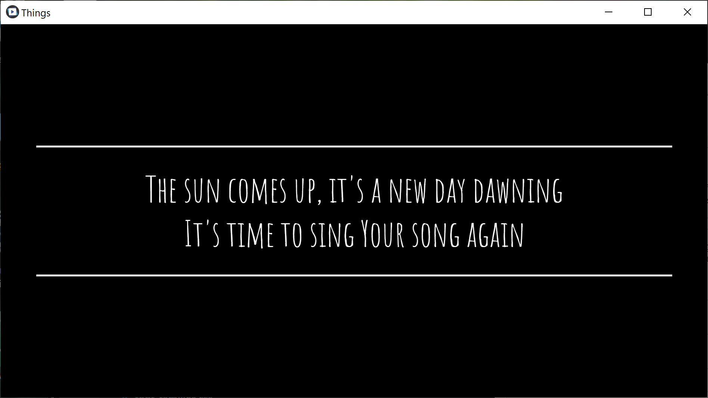
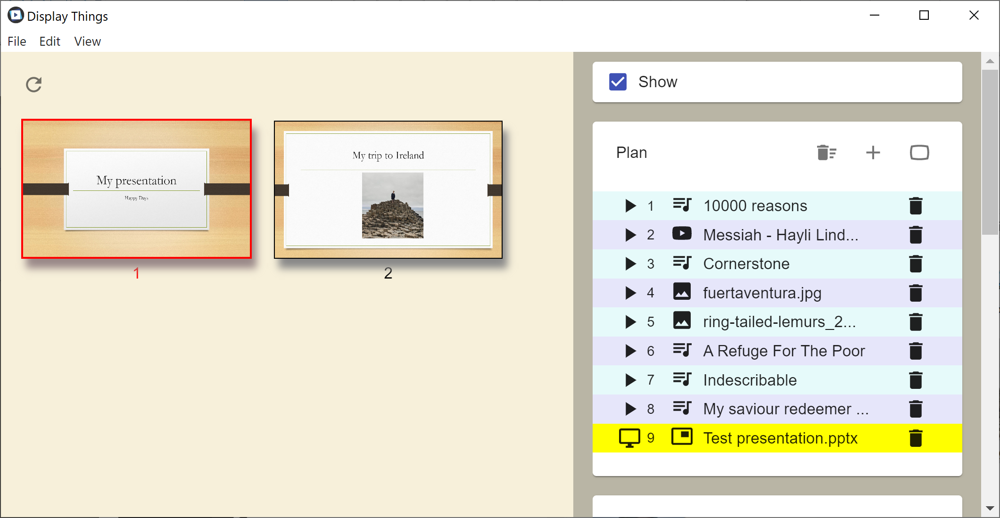
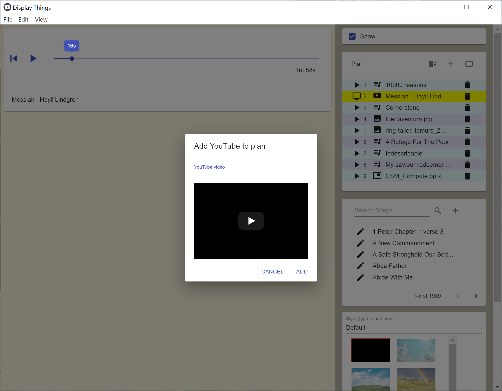

# DisplayThings

Display Song words, Videos, PowerPoints*, PDFs, YouTube, Pictures, MP4 Videos, MP3 sounds on a second screen while controlling the display on the first screen. Set up a plan by dragging and dropping items. 

## Show song words

## Customise the look


## Show PowerPoints and PDFs

## Show YouTube videos, mp4s, pictures.


You can import song files exported from SongPro. These have the form:

MySong.txt
```
#1
...
#2
...
#C
...
#B
...
```

Available for Windows, Mac and Linux.

Download here:

Note: These are not digitally signed so may not run on your computer. You can build from source to get around this by following the instructions in the github project.

[](https://github.com/iain-h/DisplayThings/releases/download/1.0.0/DisplayThings.Setup.1.0.0.exe)

[](https://github.com/iain-h/DisplayThings/releases/download/1.0.0/DisplayThings-1.0.0.dmg)

[](https://github.com/iain-h/DisplayThings/releases/download/1.0.0/DisplayThings-1.0.0.AppImage)

*Displaying PowerPoint presentations requires you to install the free [LibreOffice](https://www.libreoffice.org/) software.
